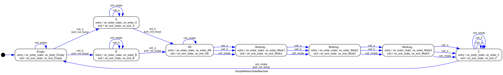

# Factory Simulation

## Outline 

There is a factory production line around a single conveyor belt.

Components (of type A and B) come onto the start of the belt at random intervals; workers
must take one component of each type from the belt as they come past, and combine them
to make a finished product

The belt is divided into fixed-size slots; each slot can hold only one component or one
finished product. There are a number of worker stations on either side of the belt, spaced to
match the size of the slots on the belt, like this:

```
     v   v   v   v   v workers
   ---------------------
-> | A |   | B | A | P | -> conveyor belt
   ---------------------
     ^   ^   ^   ^   ^ workers
```

In each unit of time, the belt moves forwards one position, and there is time for a worker on
one side of each slot to either take an item from the slot or replace an item onto the belt.
The worker opposite can't touch the same belt slot while they do this. (So you can't have one
worker picking something from a slot while their counterpart puts something down in the
same place).

Once a worker has collected one of both types of component, they can begin assembling the
finished product. This takes an amount of time, so they will only be ready to place the
assembled product back on the belt on the fourth subsequent slot. While they are
assembling the product, they can't touch the conveyor belt. Workers can only hold two items
(component or product) at a time; one in each hand.

Create a simulation of this, with three pairs of workers. At each time interval, the slot at the
start of the conveyor belt should have an equal (1/3) chance of containing nothing, a
component A or a component B.

Run the simulation for 100 steps, and compute how many finished products come off the
production line, and how many components of each type go through the production line
without being picked up by any workers.

## Solution overview

Key entities of the simulation are *Worker*, *Cell* and *Belt*. The Belt is a linear collection of Cells. Each Worker is assigned to a single Cell. the Belt and Workers are simulation entities which will receive and update event (through `tick()`) on each simulation time increment. Cells are managed by the Belt, and are purely there to capture the state of the belt at any time. Cells can be _busy_ in which case they will refuse further actions. Cells can be refreshed (via `refresh()`) to make them available again. The Belt is in charge of refreshing Cells.

The worker is simulated with a naive state machine, whose current limitations include not using the second inventory slot to pick up new inputs once a component has been assembled, waiting instead for an empty slot to be available.

The state machine for the worker is shown below, where events that trigger transitions are new contents of the work cell the worker is assigned to.



Simualtion parameters can be tuned using command line arguments as described in the usage section. 

## Installation

this project was written in `Python 3.12`.

The dependencies for this project are documented in `pyproject.toml`. Using [Poetry](https://python-poetry.org/) is recommended. 

Run `poetry install` in this subdirectory to install the dependencies.

## Usage

Recommended usage is via poetry, which will manage dependencies and environment. To do this, use `poetry run python factory.py`

```
Usage: factory.py run [OPTIONS]

  Runs the factory simulation.

Options:
  --output-file FILENAME     Save simulation data to file
  -t, --ticks INTEGER        Simulation length in ticks
  -v, --verbose BOOLEAN      Show simulation progress
  -s, --seed TEXT            Random seed
  -b, --belt-length INTEGER  Length of belt
  -w, --workers INTEGER      Number of workers per work cell
  --help                     Show this message and exit.
```

## Further work

- [ ] **Cumulative flow diagram of process** - A great way of visualising the factory process would be to output a [Cumulative Flow Diagram](https://en.wikipedia.org/wiki/Cumulative_flow_diagram) of the simulation run. This would allow at-a-glance analysis of the simulation parameters to identify their effects on work in progress and latency. 
- [ ] **Parallelize work across cells** - The simulation is trivially paralleliseable at the level of work cells. The work for each cell is carried out independently and this could be exploited to improve performance across long belts (1000+ cells), which is currently poor.
- [ ] **Tunable worker inventory size** - The inventory size for a worker is currently determined implicitly by its state machine. It would be nice to have this as a tuning parameter.
- [ ] **Alternative worker strategies** - The current worker strategy is naive and greedy. It would be interesting to explore more advanced worker strategies that take into account the local or global state of the simulation. For example, by not picking up an item that is being waited on by another worker down the belt. 
- [ ] **Worker factory that generates workers based on work specification** - The current specification for a worker is done via a state machine. This approach works well for decidability and ease of simulation, but makes it hard to easily generate new workers. An improvement would be to create a worker factory which takes in worker parameters (size of inventory, greedy/cooperative, number of steps to complete assembly, assembly recipe, etc...) and generates a worker automatically.
